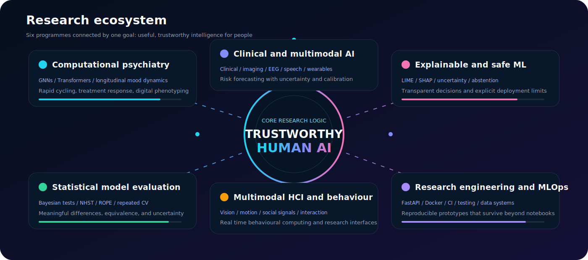
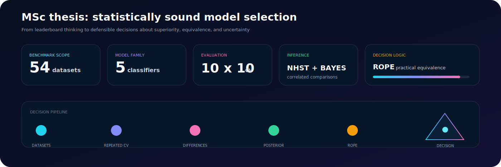
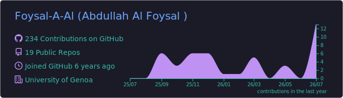
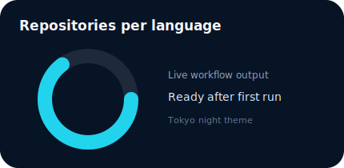
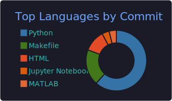
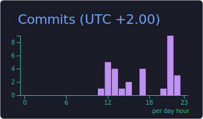
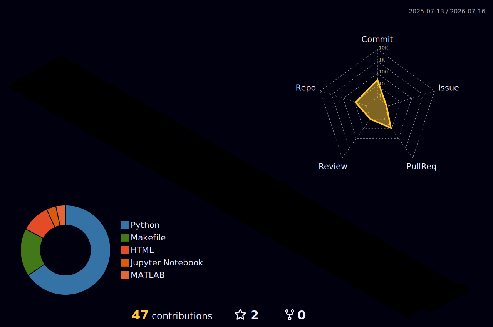

  

  
  
  
  
  

<table>
<tr>
<td width="28%" align="center" valign="top">

### Abdullah Al Foysal

**AI / ML Researcher**

Genoa, Italy  
University of Genoa  
Casa Paganini InfoMus Lab

Open to **PhD positions, research collaborations, and AI roles** focused on healthcare, psychology, neuroscience, and human centered intelligent systems.

</td>
<td width="72%" valign="top">

## Research profile

I build machine learning systems for questions where prediction alone is not enough. My work combines **computational psychiatry, clinical and multimodal AI, psychology, human behaviour, explainable machine learning, Bayesian evaluation, and research engineering**.

My research moves across the full pipeline:

**scientific question → data design → modelling → statistical evaluation → explanation → uncertainty → usable research software**

I currently contribute to research at **Casa Paganini InfoMus Lab, University of Genoa**, working on multimodal HCI, non verbal and expressive behaviour, computer vision, movement analytics, and interactive research tools. My broader portfolio includes psychiatric prediction, treatment response modelling, mental health forecasting, trustworthy clinical AI, statistical model comparison, and production oriented ML prototypes.

> **Research principle:** high accuracy is only one part of a credible system. Healthcare and human centred AI also require calibration, interpretability, reproducibility, subgroup awareness, ethical framing, and clear limits.

</td>
</tr>
</table>

## What I work on

<table>
<tr>
<td width="33%" valign="top">

### Computational psychiatry

Longitudinal mood modelling, bipolar disorder, rapid cycling, treatment response, symptom graphs, temporal representations, digital phenotyping, and clinically meaningful forecasting.

</td>
<td width="33%" valign="top">

### Clinical and multimodal AI

Fusion of clinical, pharmacological, behavioural, speech, imaging, EEG, wearable, and contextual variables for state estimation, deterioration risk, and patient trajectory modelling.

</td>
<td width="33%" valign="top">

### Explainable and safe ML

LIME, SHAP, permutation importance, calibration, bootstrap uncertainty, abstention, fairness checks, subgroup evaluation, model cards, data cards, and responsible deployment boundaries.

</td>
</tr>
<tr>
<td valign="top">

### Statistical model evaluation

Frequentist inference, Bayesian correlated tests, ROPE decisions, repeated cross validation, multiple classifier comparison, practical equivalence, and uncertainty aware model selection.

</td>
<td valign="top">

### Multimodal HCI and behaviour

Computer vision, optical flow, expressive movement, clusterability, non verbal signals, social behaviour, real time dashboards, and interactive systems for research and health.

</td>
<td valign="top">

### Research engineering and MLOps

Reproducible pipelines, leakage aware splitting, FastAPI, Streamlit, PyQt6, Docker, GitHub Actions, tests, documentation, graph and NoSQL databases, and cloud ready prototypes.

</td>
</tr>
</table>

## Selected public systems

<table>
<tr>
<td width="50%" valign="top">

### [PsychoGraph-Net](https://github.com/Foysal-A-Al/PsychoGraph-Net)

A graph augmented temporal architecture for bipolar disorder rapid cycling prediction. It combines symptom co occurrence topology with longitudinal symptom dynamics and model agnostic explanation.

**Methods:** GCN, pre norm Transformer, attention pooling, fusion MLP, Neo4j, LIME  
**Evidence:** modular PyTorch design, synthetic generator, baselines, evaluation scripts, explainability, reproducible configuration

</td>
<td width="50%" valign="top">

### [NeuroFusion Mental Health AI](https://github.com/Foysal-A-Al/Neurofusion-mental-health-AI)

A research grade prototype for longitudinal mental health state monitoring and seven day deterioration risk forecasting with uncertainty aware outputs.

**Methods:** calibrated classifiers, multimodal features, bootstrap intervals, abstention  
**Evidence:** FastAPI, Streamlit, Docker, tests, CI, model card, data card, ethics documentation

</td>
</tr>
<tr>
<td valign="top">

### [Optical Flow Cluster Analyzer](https://github.com/Foysal-A-Al/Origin-of-Human-Movement)

A desktop research interface for movement quality and origin analysis using real time detection, optical flow, clustering, clusterability, validation, and export.

**Methods:** YOLOv8, Lucas Kanade, KMeans, DBSCAN, OPTICS, Hopkins statistic  
**Evidence:** PyQt6 GUI, threaded processing, live metrics, visual overlays, validation workflow

</td>
<td valign="top">

### [PyEyesWeb](https://github.com/Foysal-A-Al/PyEyesWeb)

A Python toolkit for quantitative expressive movement analysis across research, health, arts, and interactive applications.

**Methods:** kinematic features, smoothness, sliding windows, behavioural descriptors  
**Evidence:** package structure, documentation, examples, ML integration path, HCI compatibility

</td>
</tr>
<tr>
<td valign="top">

### [Psychological Analytics with Blockchain Integrity](https://github.com/Foysal-A-Al/Predictive-Analytics-for-Psychological-Outcomes-with-Blockchain-Data-Integrity)

A prototype connecting predictive psychology with a lightweight hash linked integrity layer for auditable records and model evaluation.

</td>
<td valign="top">

### [Student Stress Analysis](https://github.com/Foysal-A-Al/Stress-analysis)

A multi factor analysis of psychological, physiological, academic, social, and environmental stress variables using statistical exploration and machine learning.

</td>
</tr>
</table>

## Additional engineering work

- **[Screw Identification and Classification System](https://github.com/Foysal-A-Al/Screw-Identification-and-Classification-System):** computer vision tool for industrial hardware identification and specification reporting.
- **[Terraform Production Ready MongoDB](https://github.com/Foysal-A-Al/Terraform-Production-ready-mongodb-project6):** infrastructure as code and production oriented database deployment work.
- **[PyEyesWeb Clusterability](https://github.com/Foysal-A-Al/PyEyesWeb_Clusterability):** statistical clusterability analysis for behavioural and movement feature spaces.
- **[PyEyesWeb Statistical Moment Analyzer](https://github.com/Foysal-A-Al/PyEyesWeb_Statistical-Moment-Analyzer):** higher order statistical analysis modules for movement and behavioural signals.
- **[Brain Tumor Detection](https://github.com/Foysal-A-Al/Matlab-project-Brain-tumor-detection):** MATLAB image processing and classification prototype for brain MRI analysis.

## MSc thesis

### Statistically Sound Model Selection: A Comparative Analysis of Machine Learning Classifiers Using Bayesian and Frequentist Methods

My thesis examined how model selection changes when the question moves from **Which score is larger?** to **Is the difference statistically credible and practically meaningful?**

<table>
<tr><td><b>Benchmark</b></td><td>54 datasets and five classifiers</td></tr>
<tr><td><b>Evaluation</b></td><td>Repeated 10 x 10 cross validation</td></tr>
<tr><td><b>Frequentist analysis</b></td><td>Null hypothesis significance testing</td></tr>
<tr><td><b>Bayesian analysis</b></td><td>Bayesian correlated t test and posterior decision probabilities</td></tr>
<tr><td><b>Practical relevance</b></td><td>Region of Practical Equivalence for superiority, equivalence, and uncertainty</td></tr>
<tr><td><b>Core contribution</b></td><td>A statistically defensible framework for comparing classifiers beyond raw leaderboard differences</td></tr>
</table>

This methodology directly influences how I evaluate psychiatric, clinical, and behavioural AI systems.

## Experience

<table>
<tr>
<td width="24%"><b>Research Assistant</b></td>
<td><b>Casa Paganini InfoMus Lab, University of Genoa</b> Multimodal HCI, non verbal expressive and social behaviour, optical flow, clustering, behavioural analytics, research dashboards, and reproducible software.</td>
</tr>
<tr>
<td><b>AI and ML Research</b></td>
<td><b>Independent and collaborative research projects</b> Computational psychiatry, clinical prediction, multimodal health AI, explainability, uncertainty, privacy aware learning, and statistical evaluation.</td>
</tr>
<tr>
<td><b>Applied Engineering</b></td>
<td><b>Safety critical construction and project supervision</b> Inspection, compliance, risk identification, technical reporting, quality monitoring, and coordination across real world project constraints.</td>
</tr>
</table>

## Education

<table>
<tr><td width="24%"><b>MSc</b></td><td><b>Computer Engineering, Artificial Intelligence</b> University of Genoa, Italy Machine learning, deep learning, advanced data management, statistical model comparison, and AI research.</td></tr>
<tr><td><b>Bachelor degree</b></td><td><b>Information Engineering</b> Jiangxi University of Science and Technology, China Computing, programming, information systems, communications, and engineering foundations.</td></tr>
</table>

## Technical stack

<table>
<tr><td width="24%"><b>Machine learning</b></td><td>scikit learn, XGBoost, Random Forest, SVM, calibration, feature engineering, model selection, repeated validation</td></tr>
<tr><td><b>Deep learning</b></td><td>PyTorch, TensorFlow, CNN, RNN, LSTM, Transformers, GNN, attention, multimodal fusion, representation learning</td></tr>
<tr><td><b>Statistics and XAI</b></td><td>Bayesian inference, NHST, ROPE, bootstrap intervals, LIME, SHAP, permutation importance, calibration analysis</td></tr>
<tr><td><b>Vision and HCI</b></td><td>OpenCV, YOLO, optical flow, PyQt6, Streamlit, webcam and video processing, interactive dashboards</td></tr>
<tr><td><b>Data systems</b></td><td>pandas, NumPy, SciPy, SQL, MongoDB, Cassandra, Neo4j, graph modelling, data validation</td></tr>
<tr><td><b>Deployment and quality</b></td><td>FastAPI, Docker, GitHub Actions, Terraform, testing, linting, configuration management, model and data cards</td></tr>
</table>

## Publications and research outputs

My research outputs cover machine learning, healthcare, psychology, behavioural computing, and statistically rigorous model evaluation. The current publication list, citations, and co authorship record are available on **[Google Scholar](https://scholar.google.com/citations?user=cQ_zolQAAAAJ)**.

Current collaboration interests include:

- computational psychiatry, bipolar disorder, and neuropsychiatric modelling
- digital health, passive sensing, and longitudinal patient trajectories
- explainable, calibrated, and uncertainty aware clinical decision support
- federated and privacy preserving learning for sensitive health data
- multimodal HCI, social signals, movement, and behavioural computing
- rigorous ML benchmarking and reproducible research software

## Live GitHub intelligence

  
  
  

## 3D contribution landscape

  <picture>
    <source media="(prefers-color-scheme: dark)" srcset="./profile-3d-contrib/profile-night-rainbow.svg" />
    <source media="(prefers-color-scheme: light)" srcset="./profile-3d-contrib/profile-green-animate.svg" />
    
  </picture>

## Contribution stream

  <picture>
    <source media="(prefers-color-scheme: dark)" srcset="https://raw.githubusercontent.com/Foysal-A-Al/Foysal-A-Al/output/github-contribution-grid-snake-dark.svg" />
    <source media="(prefers-color-scheme: light)" srcset="https://raw.githubusercontent.com/Foysal-A-Al/Foysal-A-Al/output/github-contribution-grid-snake.svg" />
    
  </picture>

